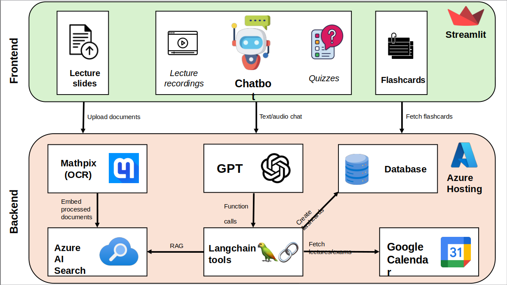

# Q-Summit 2024 , Hackathon, Mannheim Germany

Happy to be a member of the **winner team** (1st place) at the hackathon of **Q-Summit 2024, Germany’s most important conference for entrepreneurship and innovation!** ✌️🥳🥳
 
We had 2 days full of fun, creativity and networking with great leaders, brilliant minds and very nice participants.
 
There were many other prototypes that I personally like and I wish that they become products one day =)
 
Till the next Summit! 🌸
  

  

## Project: GenAI (Generative Artificial Intelligece)-Supported Study Assistant App using OpenAI API and Azure Cloud.
### Demo Video:
Demo videos can be found in the repo root dir.
  

### Software Architecture:

    
